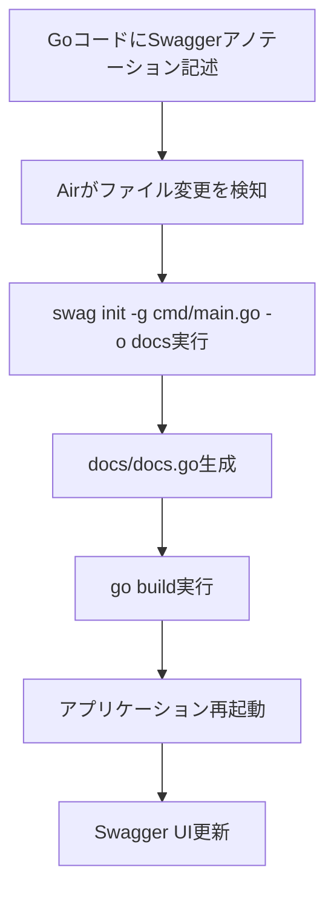

# Swagger 完全ガイド - NeuraKnot プロジェクト

## 📚 目次

1. [Swagger とは](#swaggerとは)
2. [プロジェクトでの Swagger 構成](#プロジェクトでのswagger構成)
3. [基本的な使い方](#基本的な使い方)
4. [アノテーション一覧](#アノテーション一覧)
5. [実装例](#実装例)
6. [開発フロー](#開発フロー)
7. [トラブルシューティング](#トラブルシューティング)
8. [ベストプラクティス](#ベストプラクティス)

---

## Swagger とは

Swagger（OpenAPI）は、RESTful API の仕様を記述・文書化するための標準的な仕様です。

### 🎯 主な目的

- **API 仕様の文書化**: エンドポイント、パラメータ、レスポンスを明確に記述
- **インタラクティブなドキュメント**: ブラウザで API を直接テスト可能
- **コード生成**: フロントエンドやクライアントコードの自動生成
- **チーム協力**: フロントエンド・バックエンド間の仕様共有

### 🔧 このプロジェクトで使用しているツール

- **swaggo/swag**: Go 用の Swagger 生成ツール
- **gin-swagger**: Gin フレームワーク用の Swagger UI 統合
- **Air**: ホットリロードでリアルタイム更新

---

## プロジェクトでの Swagger 構成

### 📁 ファイル構成

```
backend-go/
├── docs/                    # 生成されたSwaggerドキュメント
│   ├── docs.go             # Go用のドキュメント構造体
│   ├── swagger.json        # JSON形式のAPI仕様
│   └── swagger.yaml        # YAML形式のAPI仕様
├── api/
│   └── swagger.go          # Swaggerドキュメントのインポート
├── cmd/
│   └── main.go             # API基本情報の定義
├── internal/interface/handler/
│   ├── text_handler.go     # テキストAPIのSwaggerアノテーション
│   └── user_handler.go     # ユーザーAPIのSwaggerアノテーション
└── .air.toml               # Air設定（swag initを含む）
```

### 🔄 自動生成の流れ



### 🌐 アクセス方法

- **Swagger UI**: http://localhost:8080/swagger/index.html
- **JSON 仕様**: http://localhost:8080/swagger/doc.json
- **YAML 仕様**: http://localhost:8080/swagger/doc.yaml

---

## 基本的な使い方

### 1. API 基本情報の設定

`cmd/main.go`の先頭で API 全体の情報を定義：

```go
// @title Backend Backent Go
// @version 1.0
// @description DDDアーキテクチャを使用したGoバックエンドAPI
// @termsOfService http://swagger.io/terms/

// @contact.name API Support
// @contact.url http://www.swagger.io/support
// @contact.email support@swagger.io

// @license.name MIT
// @license.url https://opensource.org/licenses/MIT

// @host localhost:8080
// @BasePath /api/v1
// @schemes http

// @securityDefinitions.basic BasicAuth
// @in header
// @name Authorization
```

### 2. エンドポイントの定義

ハンドラー関数の直前に Swagger アノテーションを記述：

```go
// CreateText テキストを作成
// @Summary テキストを作成
// @Description POSTでテキストを受け取ってデータベースに保存します
// @Tags texts
// @Accept json
// @Produce json
// @Param request body CreateTextRequest true "テキスト作成リクエスト"
// @Success 201 {object} TextResponse "作成されたテキスト"
// @Failure 400 {object} ErrorResponse "バリデーションエラー"
// @Failure 500 {object} ErrorResponse "サーバーエラー"
// @Router /api/v1/texts [post]
func (h *TextHandler) CreateText(c *gin.Context) {
    // 実装...
}
```

### 3. データ構造の定義

リクエスト・レスポンス用の構造体を定義：

```go
// CreateTextRequest テキスト作成リクエスト
type CreateTextRequest struct {
    Title   string `json:"title" binding:"required" example:"サンプルタイトル"`
    Content string `json:"content" binding:"required" example:"これはサンプルの内容です"`
}

// TextResponse テキストレスポンス
type TextResponse struct {
    ID        int       `json:"id" example:"1"`
    Title     string    `json:"title" example:"サンプルタイトル"`
    Content   string    `json:"content" example:"これはサンプルの内容です"`
    CreatedAt time.Time `json:"created_at" example:"2024-01-01T00:00:00Z"`
    UpdatedAt time.Time `json:"updated_at" example:"2024-01-01T00:00:00Z"`
}
```

---

## アノテーション一覧

### 📋 API 基本情報

| アノテーション | 説明             | 例                                            |
| -------------- | ---------------- | --------------------------------------------- |
| `@title`       | API のタイトル   | `@title Backend Go`                           |
| `@version`     | API のバージョン | `@version 1.0`                                |
| `@description` | API の説明       | `@description DDDアーキテクチャを使用した...` |
| `@host`        | ホスト名         | `@host localhost:8080`                        |
| `@BasePath`    | ベースパス       | `@BasePath /api/v1`                           |
| `@schemes`     | 使用するスキーム | `@schemes http`                               |

### 🏷️ エンドポイント情報

| アノテーション | 説明                     | 例                                           |
| -------------- | ------------------------ | -------------------------------------------- |
| `@Summary`     | エンドポイントの短い説明 | `@Summary テキストを作成`                    |
| `@Description` | 詳細な説明               | `@Description POSTでテキストを受け取って...` |
| `@Tags`        | API のグループ分類       | `@Tags texts`                                |
| `@Accept`      | 受け付ける Content-Type  | `@Accept json`                               |
| `@Produce`     | 返す Content-Type        | `@Produce json`                              |
| `@Router`      | ルート定義               | `@Router /api/v1/texts [post]`               |

### 📥 パラメータ定義

| アノテーション    | 説明             | 例                                                            |
| ----------------- | ---------------- | ------------------------------------------------------------- |
| `@Param`          | パラメータ定義   | `@Param id path int true "テキストID"`                        |
| `@Param` (query)  | クエリパラメータ | `@Param page query int false "ページ番号"`                    |
| `@Param` (body)   | リクエストボディ | `@Param request body CreateTextRequest true "作成リクエスト"` |
| `@Param` (header) | ヘッダー         | `@Param Authorization header string true "Bearer token"`      |

### 📤 レスポンス定義

| アノテーション | 説明                 | 例                                    |
| -------------- | -------------------- | ------------------------------------- |
| `@Success`     | 成功時のレスポンス   | `@Success 200 {object} TextResponse`  |
| `@Failure`     | エラー時のレスポンス | `@Failure 400 {object} ErrorResponse` |
| `@Response`    | 汎用的なレスポンス   | `@Response 204 "削除成功"`            |

### 🔐 セキュリティ定義

| アノテーション                | 説明                         | 例                                       |
| ----------------------------- | ---------------------------- | ---------------------------------------- |
| `@securityDefinitions.basic`  | Basic 認証                   | `@securityDefinitions.basic BasicAuth`   |
| `@securityDefinitions.apikey` | API キー認証                 | `@securityDefinitions.apikey ApiKeyAuth` |
| `@Security`                   | エンドポイントのセキュリティ | `@Security BasicAuth`                    |

---

## 実装例

### 1. 基本的な CRUD API

```go
// GetTexts すべてのテキストを取得
// @Summary テキスト一覧を取得
// @Description 保存されているすべてのテキストを取得します
// @Tags texts
// @Produce json
// @Success 200 {array} TextResponse "テキスト一覧"
// @Failure 500 {object} ErrorResponse "サーバーエラー"
// @Router /api/v1/texts [get]
func (h *TextHandler) GetTexts(c *gin.Context) {
    // 実装...
}

// GetTextByID 指定されたIDのテキストを取得
// @Summary テキストを取得
// @Description 指定されたIDのテキストを取得します
// @Tags texts
// @Produce json
// @Param id path int true "テキストID"
// @Success 200 {object} TextResponse "テキスト"
// @Failure 400 {object} ErrorResponse "無効なID"
// @Failure 404 {object} ErrorResponse "テキストが見つからない"
// @Failure 500 {object} ErrorResponse "サーバーエラー"
// @Router /api/v1/texts/{id} [get]
func (h *TextHandler) GetTextByID(c *gin.Context) {
    // 実装...
}
```

### 2. 認証付き API

```go
// CreateUser ユーザーを作成
// @Summary ユーザーを作成
// @Description 新しいユーザーを作成します
// @Tags users
// @Accept json
// @Produce json
// @Param request body CreateUserRequest true "ユーザー作成リクエスト"
// @Success 201 {object} UserResponse "作成されたユーザー"
// @Failure 400 {object} ErrorResponse "バリデーションエラー"
// @Failure 409 {object} ErrorResponse "ユーザーが既に存在"
// @Failure 500 {object} ErrorResponse "サーバーエラー"
// @Security BasicAuth
// @Router /api/v1/users [post]
func (h *UserHandler) CreateUser(c *gin.Context) {
    // 実装...
}
```

### 3. クエリパラメータ付き API

```go
// SearchTexts テキストを検索
// @Summary テキストを検索
// @Description タイトルや内容でテキストを検索します
// @Tags texts
// @Produce json
// @Param q query string false "検索キーワード"
// @Param page query int false "ページ番号" default(1)
// @Param limit query int false "取得件数" default(10)
// @Success 200 {object} SearchTextsResponse "検索結果"
// @Failure 400 {object} ErrorResponse "無効なパラメータ"
// @Failure 500 {object} ErrorResponse "サーバーエラー"
// @Router /api/v1/texts/search [get]
func (h *TextHandler) SearchTexts(c *gin.Context) {
    // 実装...
}
```

---

## 開発フロー

### 1. 新しい API エンドポイントを追加する場合

1. **ハンドラー関数を実装**

   ```go
   func (h *TextHandler) NewEndpoint(c *gin.Context) {
       // 実装...
   }
   ```

2. **Swagger アノテーションを追加**

   ```go
   // @Summary 新しいエンドポイント
   // @Description 新しい機能の説明
   // @Tags texts
   // @Accept json
   // @Produce json
   // @Param request body NewRequest true "リクエスト"
   // @Success 200 {object} NewResponse "レスポンス"
   // @Router /api/v1/texts/new [post]
   func (h *TextHandler) NewEndpoint(c *gin.Context) {
       // 実装...
   }
   ```

3. **ルーターに追加**

   ```go
   r.POST("/api/v1/texts/new", h.NewEndpoint)
   ```

4. **自動生成を確認**
   - ファイルを保存すると Air が自動で`swag init`を実行
   - Swagger UI で確認: http://localhost:8080/swagger/index.html

### 2. 既存の API を修正する場合

1. **コードを修正**
2. **Swagger アノテーションを更新**
3. **ファイルを保存**（自動で Swagger ドキュメントが更新される）

### 3. データ構造を変更する場合

1. **構造体を修正**
2. **Swagger アノテーションを更新**
3. **ファイルを保存**（自動で Swagger ドキュメントが更新される）

---

## トラブルシューティング

### ❌ よくある問題と解決方法

#### 1. Swagger ドキュメントが更新されない

**症状**: コードを変更しても Swagger UI に反映されない

**原因と解決方法**:

- **ボリュームマウントの問題**: `docker-compose.yml`で`/app/docs`が除外されていないか確認
- **Air の再起動**: `./dev.sh restart`でコンテナを再起動
- **完全再ビルド**: `./dev.sh rebuild`で完全に再ビルド

#### 2. Swagger アノテーションが認識されない

**症状**: アノテーションを書いても Swagger に表示されない

**原因と解決方法**:

- **構文エラー**: アノテーションの構文を確認
- **位置の問題**: 関数の直前にアノテーションを配置
- **大文字小文字**: `@Summary`、`@Description`などは大文字で始める

#### 3. 型情報が正しく表示されない

**症状**: 構造体の型情報が Swagger に正しく反映されない

**原因と解決方法**:

- **構造体の公開**: 構造体とフィールドが公開されているか確認
- **json タグ**: `json`タグが正しく設定されているか確認
- **example タグ**: `example`タグでサンプル値を設定

#### 4. 認証が正しく動作しない

**症状**: 認証が必要な API が Swagger UI でテストできない

**原因と解決方法**:

- **セキュリティ定義**: `@securityDefinitions`が正しく設定されているか確認
- **エンドポイントのセキュリティ**: `@Security`アノテーションが設定されているか確認

### 🔧 デバッグ方法

#### 1. Swagger ドキュメントの確認

```bash
# JSON形式で確認
curl http://localhost:8080/swagger/doc.json | jq

# 特定のエンドポイントを確認
curl http://localhost:8080/swagger/doc.json | jq '.paths."/api/v1/texts".get'
```

#### 2. Air のログ確認

```bash
# コンテナのログを確認
docker-compose -f docker-compose/dev.yml logs backend-go

# リアルタイムでログを確認
docker-compose -f docker-compose/dev.yml logs -f backend-go
```

#### 3. 生成されたファイルの確認

```bash
# 生成されたSwaggerファイルを確認
ls -la backend-go/docs/
cat backend-go/docs/swagger.json
```

---

## ベストプラクティス

### ✅ 推奨事項

#### 1. アノテーションの記述

- **一貫性**: チーム内でアノテーションの記述ルールを統一
- **詳細な説明**: `@Description`でエンドポイントの詳細を記述
- **適切なタグ**: `@Tags`で API を論理的にグループ化
- **例の提供**: `example`タグでサンプル値を提供

#### 2. データ構造の設計

- **明確な命名**: 構造体とフィールド名を分かりやすく命名
- **適切な型**: データの性質に応じて適切な型を使用
- **バリデーション**: `binding`タグでバリデーションルールを設定
- **ドキュメント**: フィールドの説明をコメントで記述

#### 3. エラーハンドリング

- **統一されたエラー形式**: エラーレスポンスの構造を統一
- **適切な HTTP ステータス**: 状況に応じて適切なステータスコードを使用
- **エラーメッセージ**: ユーザーにとって分かりやすいエラーメッセージ

#### 4. セキュリティ

- **認証の明示**: 認証が必要な API は`@Security`で明示
- **権限の明確化**: 各エンドポイントの権限要件を明確化
- **セキュリティ定義**: 認証方式を`@securityDefinitions`で定義

### ❌ 避けるべきこと

#### 1. アノテーションの記述

- **不正確な情報**: 実際の実装と異なるアノテーション
- **省略しすぎ**: 必要な情報を省略したアノテーション
- **一貫性のない記述**: チーム内で異なる記述ルール

#### 2. データ構造の設計

- **曖昧な命名**: 何を表すか分からない名前
- **不適切な型**: データの性質に合わない型の使用
- **過度な複雑さ**: 必要以上に複雑な構造

#### 3. エラーハンドリング

- **統一されていないエラー形式**: エンドポイントごとに異なるエラー形式
- **不適切なステータスコード**: 状況に合わない HTTP ステータス
- **技術的なエラーメッセージ**: ユーザーにとって分からないメッセージ

---

## 📚 参考資料

### 公式ドキュメント

- [Swagger 公式サイト](https://swagger.io/)
- [OpenAPI 仕様](https://swagger.io/specification/)
- [swaggo/swag](https://github.com/swaggo/swag)
- [gin-swagger](https://github.com/swaggo/gin-swagger)

### プロジェクト内の関連ファイル

- `backend-go/.air.toml` - Air 設定
- `backend-go/cmd/main.go` - API 基本情報
- `backend-go/internal/interface/handler/` - ハンドラー実装
- `docker-compose/dev.yml` - 開発環境設定

### 便利なコマンド

```bash
# 開発環境の起動
./dev.sh start

# 開発環境の再ビルド
./dev.sh build

# 完全再ビルド
./dev.sh rebuild

# ログの確認
./dev.sh logs

# サービス状態の確認
./dev.sh status
```

---

## 🎯 まとめ

Swagger を使用することで、以下のメリットを得られます：

1. **自動生成**: コードから自動で API 仕様書を生成
2. **同期保証**: コードとドキュメントが常に同期
3. **テスト可能**: Swagger UI で直接 API テスト
4. **チーム共有**: フロントエンド開発者と仕様共有が容易
5. **型安全**: Go の構造体から型情報を自動取得

このガイドを参考に、効果的な API 開発を行ってください！

---

_最終更新: 2024 年 9 月 14 日_
_作成者: NeuraKnot 開発チーム_
